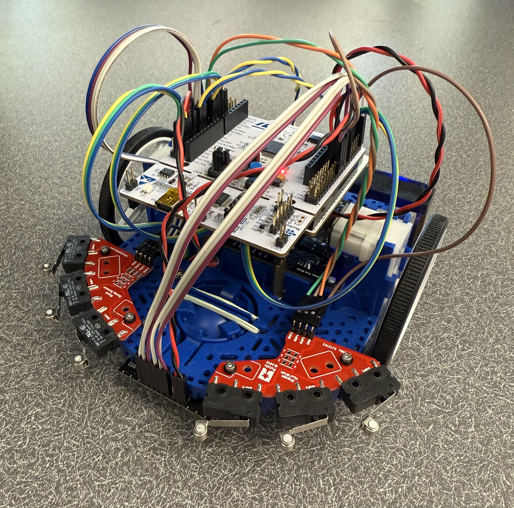

# Automated Differential-Drive Robot

## Project Overview
This repository contains the software framework and implementation for a ROMI robot platform, developed as part of Cal Poly ME405 (Winter 2025). The project demonstrates the application of embedded systems programming, hardware interfacing, and closed-loop control for autonomous robot navigation.



## Features
- Cooperative multitasking system for concurrent operations
- Motor control with PWM and direction control
- Quadrature encoder position and velocity measurements
- Line following using IR sensor array
- Inertial measurement (IMU) for heading control and navigation
- PID closed-loop control implementation
- Task sharing mechanism for inter-task communication

## Hardware Components
- ROMI Robot Chassis
- Nucleo-L476RG microcontroller
- DRV8838 Motor Drivers
- Quadrature Encoders
- Polulu QTR-MD-06A Reflectance Sensor Array: 6-channel, 8mm pitch
- BNO055 IMU for Orientation Sensing

## Electrical Diagram

## Software Architecture
The software architecture is built on a cooperative multitasking system that allows multiple tasks to run concurrently.

### Task Structure
The system is organized into several cooperative tasks:
- Motor control task
- Encoder reading task
- Sensor reading task
- User interface task
- Navigation task

### Key Software Components
1. **Cooperative Multitasking (`cotask.py`)**: Manages task scheduling and execution
2. **Inter-Task Communication (`task_share.py`)**: Provides thread-safe data sharing between tasks
3. **Motor Driver (`motor_class.py`)**: Controls motor speed and direction
4. **Encoder Interface (`encoder_class.py`)**: Reads and processes quadrature encoder signals
5. **IR Sensor Interface (`IR_Sensor.py`)**: Processes line sensor readings
6. **IMU Interface (`lab_0x05.py`)**: Communicates with the BNO055 IMU
7. **PID Controller (`PID.py`)**: Implements closed-loop PID control

## Getting Started

### Prerequisites
- MicroPython-compatible board (e.g., Nucleo with STM32)
- ROMI robot platform with motors and encoders
- IR sensor array
- BNO055 IMU

### Installation
1. Clone this repository
2. Connect your Nucleo board to your computer
3. Transfer the Python files to the Nucleo board
4. Run `main.py` to start the system

## Project Demonstrations

### Line Following
The robot can follow a black line on a light background using the IR sensor array and PID control:

[Video Link Here]

### North-Seeking Behavior
Using the BNO055 IMU, the robot can determine its orientation and turn to face north:

[Video Link Here]

### Circle Driving
The robot can drive in a precise 2ft diameter circle using closed-loop control:

[Video Link Here]

## Code Documentation

### Motor Control
The `Motor` class provides an interface for controlling the ROMI's motors:
```python
motor = Motor((timer_num, channel, pin), dir_pin, enable_pin)
motor.enable()
motor.set_effort(50)  # 50% speed forward
motor.set_effort(-25)  # 25% speed backward
motor.disable()
```

### Encoder Reading
The `Encoder` class handles reading position and velocity from quadrature encoders:
```python
encoder = Encoder(timer_num, channel_A_pin, channel_B_pin)
encoder.update()
position = encoder.get_position()
velocity = encoder.get_velocity()
encoder.zero()  # Reset position to zero
```

### IR Sensor Array
The `SensorArray` class processes readings from multiple IR sensors:
```python
sensors = SensorArray(pin_list)
readings = sensors.read_linearized()
centroid = sensors.get_centroid(readings)
```

### PID Control
The `PIDController` class implements a proportional-integral-derivative controller:
```python
controller = PIDController(Kp, Ki, Kd)
correction = controller.calculate(error)
```

## Team Members
- Aiden D. Hall
- Gerardo Tapia-Onate

## Acknowledgments
- Charlie Revfem, Cal Poly Mechanical Engieering Professor
- J.R. Ridgely, Cal Poly Mechanical Engineering Professor
