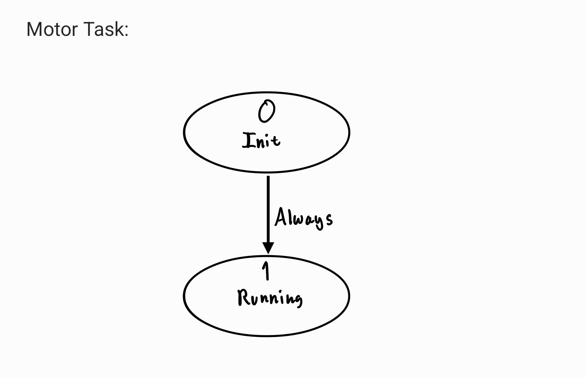

# Automated Differential-Drive Robot

## Project Overview
This repository contains the software framework and implementation for a ROMI robot platform, developed as part of Cal Poly ME405 (Winter 2025). The project demonstrates the application of embedded systems programming, hardware interfacing, and closed-loop control for autonomous robot navigation.


## Features
- Cooperative multitasking system for concurrent operations
- Motor control with PWM and direction control
- Quadrature encoder position and velocity measurements
- Line following using IR sensor array
- Inertial measurement (IMU) for heading control and navigation
- PID closed-loop control implementation
- Task sharing mechanism for inter-task communication

## Hardware Components
- Romi Chassis kit, Polulu Robotics
- Romi Ball Caster Kit, Polulu Robotics
- Romi Power Distribution Board, Polulu Robotics
- Romi Encoder Pair Kit, Polulu Robotics
- Nucleo-L476RG microcontroller
- QTR-MD-06A Reflectance Sensor Array: 6-channel, 8mm pitch, Polulu Robotics
- BNO055 IMU

## Electrical Diagram


## Software Architecture
The software architecture is built on a cooperative multitasking system that allows multiple tasks to run concurrently based on a determined priority and period for each task. Each task uses a finite state machine architecture. The tasks use shared variables to store data and communcicate. The shared variables used are the left and right encoder position and motor effort, the line position as read by the IR sensor, the initial heading and current heading as read by the IMU, a flag to indicate if the motors are running, a flag to indicate if a bump has been detected, the mode that Romi is operating at, and the position threshold for Romi to reach based on encoder count.

| **Variable Name**        | **Data Type** | **Purpose**                                                                 |
|--------------------------|---------------|-----------------------------------------------------------------------------|
| `effort_L`               | Float         | Holds the value of the desired left motor effort                            |
| `effort_R`               | Float         | Holds the value of the desired right motor effort                           |
| `line_position`          | Float         | Holds the value of the line position based on the IR sensor array in the form of its centroid |
| `heading`                | Float         | Holds values of current and target directional headings                     |
| `initial_heading`        | Float         | Used to store and hold the directional heading obtained upon initialization of Romi |
| `bump_state`             | Byte          | Flag to communicate between tasks that the bump sensors have been triggered |
| `mode`                   | Byte          | Flag that changes based on which mode it currently is in, allowing certain sections of each task to run |
| `run_state`              | Byte          | Flag to communicate between tasks that states whether the motors are running or not |
| `position_threshold`     | Integer       | A flag to let tasks know that a certain position has been reached          |

### Task Structure
The system is organized into several cooperative tasks:
- Motor control task
- Line task
- Position task
- Bump Task
- IMU task

INSERT TASK DIAGRAM

#### Motor Control Task
The motor control task is responsible for setting the desired effort for the motors. It takes in three shares: the left and right motor effort, and the run state flag to indicate whether to set the efforts or stop the motors.


#### Line Following Task
The line following task reads linearized data from the infrared sensor based on the white and black calibration values, returns the centroid of the readings, calculates the error from the desired centroid (3.5 because we have a 6 sensor array), and passes the error to the PID controller to calculate the steering correction.


#### Position Task
The position task is used to control portions of the track where the robot is not line following. These two portions of the track are to pass through the diamond and the grid navigation. We chose to switch to encoder and heading control to get through the diamond portion becuase our infrared sensor was too small to respond to the sharp diamond turns without making our line following controller unstable. To traverse through the grid section, we take an intial heading at our start point to use as a reference heading, and when entering the grid, we adjust Romi's heading to 180 degrees from the initial heading. Then we use PID control and encoder distance control to drive through the grid, make a 90 degree turn, and return to line following at checkpoint 5. The states of the position task consist of changing to a desired heading based off of our reference heading and drving forward a set amount of encoder ticks.


#### Bump Task
The bump task, similar to the position task, uses encoder and heading control to maneuver around the wall and to the finish line after bumping into the wall. The states of the line task consist of checking for an input from the bump sensors, and then a series of operations that consist of changing to a desired heading based off of our reference heading and drving forward a set amount of encoder ticks.


#### IMU Task
The IMU task is minimal and is responsible for updating the heading share at every run of the task. Upon the first run of the task, the heading is stored in the initial_heading share.


### Control Classes and Hardware Drivers
1. **Cooperative Multitasking (`cotask.py`)**: Manages task scheduling and execution
3. **Inter-Task Communication (`task_share.py`)**: Provides thread-safe data sharing between tasks
4. **Motor Driver (`motor_class.py`)**: Controls motor speed and direction
5. **Encoder Interface (`encoder_class.py`)**: Reads and processes quadrature encoder signals
6. **IR Sensor Interface (`IR_Sensor.py`)**: Processes line sensor readings
7. **IMU Interface (`IMU.py`)**: Communicates with the BNO055 IMU
8. **PID Controller (`PID.py`)**: Implements closed-loop PID control
9. **Bump Sensor (`bump_sensor.py`)**: Reads signals from bump sensors

## Project Demonstrations


Romi has been specifically programmed to traverse through the course above, which has line following segments, a grid navigation portion, and a wall to maneuver around.

[Click Here for Demonstration Video](https://youtu.be/j0VFErPfen4)

## Code Documentation

### Motor Control
The `Motor` class provides an interface for controlling the ROMI's motors:
```python
motor = Motor((timer_num, channel, pin), dir_pin, enable_pin)
motor.enable()
motor.set_effort(50)  # 50% speed forward
motor.set_effort(-25)  # 25% speed backward
motor.disable()
```

### Encoder Reading
The `Encoder` class handles reading position and velocity from quadrature encoders:
```python
encoder = Encoder(timer_num, channel_A_pin, channel_B_pin)
encoder.update()
position = encoder.get_position()
velocity = encoder.get_velocity()
encoder.zero()  # Reset position to zero
```

### IR Sensor Array
The `SensorArray` class processes readings from multiple IR sensors:
```python
sensors = SensorArray(pin_list)
readings = sensors.read_linearized()
centroid = sensors.get_centroid(readings)
```

### PID Control
The `PIDController` class implements a proportional-integral-derivative controller:
```python
controller = PIDController(Kp, Ki, Kd, dt)
correction = controller.calculate(error)
```

### Bump Sensor
The `BumpSensor` class reads values from our bump sensors and determines whether the bump occus on the left or right hand side of Romi's front.
```python
bump_sensors = BumpSensorArray(left_pins, right_pins)
bump_result = bump_sensors.check_bump()
bump_sensor.is_left_collision()
bump_sensor.is_right_collision()
```

## Future Improvements
- Implement PID control for heading changes to achieve higher accuracy and higher speed
- Implement cascaded control system, which includes adding PID control for motor speed and position
- Incorporate larger infrared sensor with more channels to get a larger field of view and achieve faster line following speed

## Team Members
- Aiden D. Hall
- Gerardo Tapia-Onate

## Acknowledgments
- Charlie Revfem, Cal Poly Mechanical Engieering Professor
- J.R. Ridgely, Cal Poly Mechanical Engineering Professor
